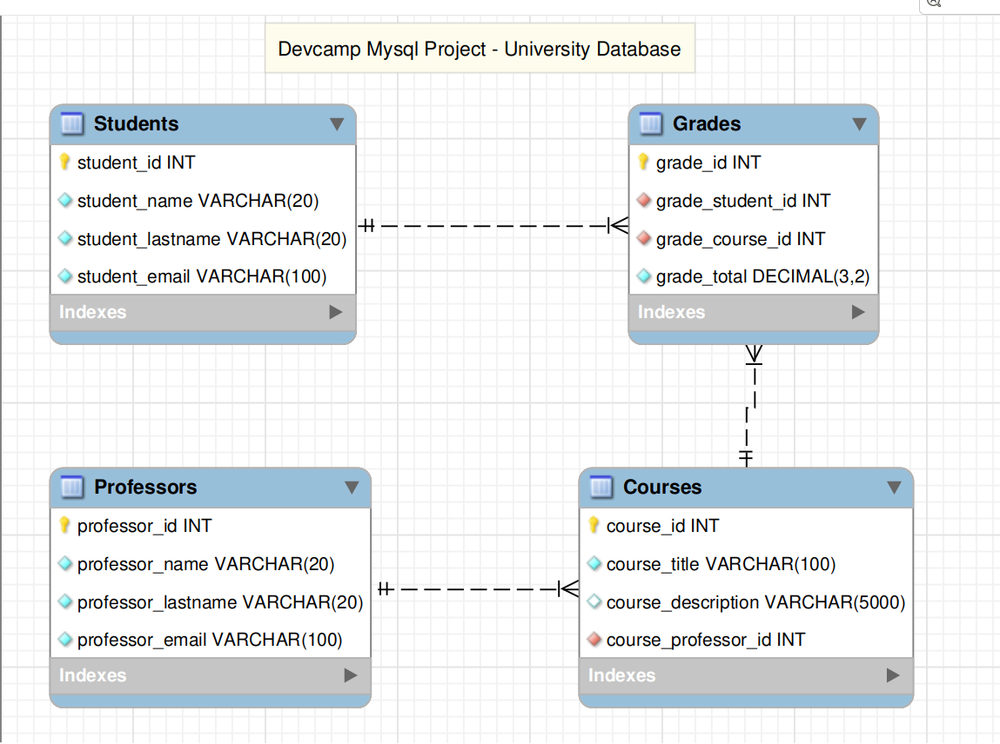

# Project SQL Devcamp

## University Database

---

### Project Technical Requirements

The project needs to contain the following technical features:

- Build a database with the following tables: Students, Courses, Professors, Grades
- Foreign key relationships between the tables
- Create a script that populates all of the database tables with sample data.
- SQL query scripts for:
  - 1 - The average grade that is given by each professor
  - 2 - The top grades for each student
  - 3 - Sort students by the courses that they are enrolled in
  - 4 - Create a summary report of courses and their average grades, sorted by the most challenging course (course with the lowest average grade) to the easiest course
  - 5 - Finding which student and professor have the most courses in common

---

### Build Database

We are going to use the MySQL Workbench tool to generate the database and their tables.
We have four tables:

- Students
- Professors
- Courses
- Grades

Students and Professors are tables with basic data about these user types.
We will asume about a course has only one professor assigned, who is defined by the foreign key course_professor_id in the Courses table.
The Grades table is where we have the relations between courses and students, and we store the grade reached for the students of each course.

The bellow Class Diagram show database entities (tables) and their fields, with the data types of each field and the foreigns keys between the tables:

We can execute the file "create_database_devcamp_university.sql" to create the database and tables.
